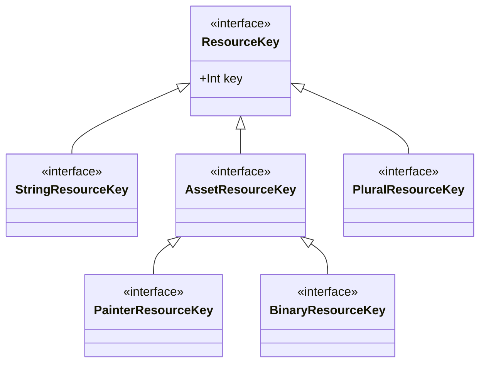

# Kostra

[](https://jitpack.io/#jbruchanov/kostra)

A library trying to help with resources in [KMP](https://blog.jetbrains.com/kotlin/2023/07/update-on-the-name-of-kotlin-multiplatform/)
project, currently supported platforms are `JVM`, `Android`, `iOS`, and experimentally `Native`.
Kostra is basically trying to do same what Android does with resources. It generates an object having references to actual resources for easy
usage using autocomplete and having also compile time validation that reference itself exists.

There are 4 basic categories *strings, plurals, painters, binaries*. *Strings/Plurals* are supported via
[Android Strings](https://developer.android.com/guide/topics/resources/string-resource). *Painters* are equivalent of Android drawables, aka anything what can be drawn/painted.
*Binaries* is the group for anything else what can be loaded as simple raw data.
All 4 categories have own resource key types ([value class](https://kotlinlang.org/docs/inline-classes.html))
`StringResourceKey`, `PluralResourceKey`, `PainterResourceKey`, `BinaryResourceKey` to get immediate compile time error when resources misused.



Kostra is converting string XML files into own DB like structure to avoid any extra processing during runtime. For this particular reason, the XML files are unnecessary in
runtime and doesn't have to be included as part of your project resources which are bundled as part of a release product. <br/> See
[Kostra Plugin Config](https://github.com/jbruchanov/kostra/develop/README.md#gradle-plugin) how to include string XMLs for kostra processing, without having them included
into a release product. The strings DB has `O(1)` access time, the painters/binaries DB has `O(log(n))` access time.

#### Strings

Simply follow [Android Strings](https://developer.android.com/guide/topics/resources/string-resource) rules.
See [limitations](https://github.com/jbruchanov/kostra?tab=readme-ov-file#limitations) for few exceptions.

#### Plurals/Ordinals

Similarly like for strings, just follow [Android Strings](https://developer.android.com/guide/topics/resources/string-resource) rules. The library has own support for plurals &
ordinals generated via [CLDR](https://cldr.unicode.org/) rules similarly what is being used in Android/iOS.

To update to the latest CLDR rules, run `./gradlew kostra-gradle-plugin:generateRuleSpecsForKostraCommonLib`

#### Painters

In general, this is special case of binary resource for better safety support of compose `painterResourse` function. You will get what your platform supports.
[Common](https://github.com/jbruchanov/kostra/blob/develop/kostra-gradle-plugin/src/main/kotlin/com/jibru/kostra/plugin/KostraPluginConfig.kt#L16)
image formats like jpgs or pngs are marked with `PainterResourceKey`. KMP Compose supports also
[VectorDrawables](https://developer.android.com/develop/ui/views/graphics/vector-drawable-resources),
which is sort of SVG with limited subset of features. Due to the separation of painter vs binary resource key as both files are `.xml`. Simply use `.vxml` file
extension for those, or tweak `kostra.painterGroups` in [Kostra Plugin Config](https://github.com/jbruchanov/kostra/develop/README.md#gradle-plugin).
<br/>
*SVG format is supported only on desktop JVM (not Android), even if they are marked with PainterResourceKey*

#### Binaries

Not much to add here. Simply anything what can be read as raw data.

## Qualifiers

Qualifiers are definable per file/folder seperated by a dash. Similarly like [Android](https://developer.android.com/guide/topics/resources/providing-resources#QualifierRules) uses
them. The library supports only 2 type of qualifiers.
[DPI](https://github.com/jbruchanov/kostra/blob/develop/lib-kostra-common/src/commonMain/kotlin/com/jibru/kostra/KDpi.kt) &
[Locale](https://github.com/jbruchanov/kostra/blob/develop/lib-kostra-common/src/commonMain/kotlin/com/jibru/kostra/KLocale.kt).

General format: `<group>-<qualifier>/**/<resources_key>-<qualifier>`
<br />
Example: `image-en-rGB-xxhdpi/flag.jpg` or `image/flag-en-rGB-xxhdpi.jpg`

DPI is defined as a set of `nodpi`, `ldpi`, `mdpi`, `hdpi`, `xhdpi`, `xxhdpi`, `xxxhdpi`, `tvdpi` values in same way what
[Android](https://developer.android.com/guide/topics/resources/providing-resources#AlternativeResources) is using.
<br/>
The language is defined by a two-letter [ISO 639-1](http://www.loc.gov/standards/iso639-2/php/code_list.php) language code,
optionally followed by a two-letter [ISO 3166-1-alpha-2](https://www.loc.gov/standards/iso639-2/php/code_list.php) region code (preceded by lowercase `r`). <br />

- order of qualifiers don't matter.
- a dash `-` is qualifier divider, so key is defined by filename upto first `-` found.
- file/folder structure is quite open to anything valid by OS filesystem  (or what can be translated into kotlin code). Unlike Android, deeper folder structure is allowed.
- `group` is optional, if undefined given the file saved directly in "resources" folder directly, they will be put into `root` group.
- any non-easily translatable names to kotlin property will be escaped using backticks, for example ``` K.image.`1` ```.
- files with empty key are ignored, e.g. `".DS_STORE"`, on the other hand file `" .xml"` is valid and accessible via ``` K.root.` ` ```.
- if `kostra.strictLocale = false` locale can be anything `[a-Z]{2,4}`, otherwise must be known combination for `java.util.Locale`.
- DPI qualifier is ignored for strings!
- device DPI must match exactly the DPI qualifier, otherwise goes directly for a default/fallback value. There is currently no
  [BestMatch](https://developer.android.com/guide/topics/resources/providing-resources#BestMatch) like Android has. (`XXHDPI` device takes `XXHDPI` orElse `Default` only)
- Duplicated **key with same qualifiers** records are ignored and only 1 is taken, it's upto developer to prevent this!

Few examples:

```shell
#key='flag'
#default/fallback, taken no matter DPI, Locale,
resources/images/flag.png
#taken when DPI is XXHDPI no matter of locale
resources/images-xxhdpi/flag.png
#taken when any EN locale, no matter of DPI
resources/images-en/flag.png
#taken when EN-GB locale, no matter of DPI
resources/images-en-rGB/flag.png
#taken when EN locale && XXHDPI
resources/images-xxhdpi-en/flag.png
#taken when EN locale && XXHDPI
resources/images-en-rGB-xxhdpi/flag.png

#strings can be simply in 1 folder as the qualifier can be on the file itself
resources/strings/strings.xml
resources/strings/strings-en.xml
resources/strings/strings-en-rUS.xml

#unknown qualifier can be taken as a locale if `kostra.strictLocale = false`
resources/images/flag-xxxx.png
```

Few **BAD** examples:

```shell
#multiple qualifiers in path, only `-en` is taken because it's "closer" the file, no qualifiers merging!
resources/images-xhdpi/subfolder/flag-en.png
#duplicated key='flag', takes last processed, undefined which one it is
resources/images/s1/flag.png
resources/images/s2/flag.png
#en-rUS, region always follows immediately after language, will be processed as '-en-xxhdpi'
resources/images/flag-en-xxhdpi-rUS.png
#multiple same category qualifiers, first one taken => 'en' wins
resources/images/flag-en-cs.png
#multiple same category qualifiers, first one taken => 'xxhdpi' wins
resources/images/flag-xxhdpi-xhdpi.png
#unknown qualifier => ignored
resources/images/flag-xxxxdpi.png
#avoid any spaces, it's just calling for troubles, ' xxhdpi' will be ignored as it's not 'xxhdpi'
resources/images/flag - xxhdpi.png
```

`./gradlew generateResources --info --rerun` might help for understanding or troubleshooting how are files being processed.

## Installation

```groovy
//build.gradle (root)
buildscript {
    repositories {
        maven("https://jitpack.io")
    }
    dependencies {
        classpath("com.github.jbruchanov.kostra:com.jibru.kostra.resources.gradle.plugin:version")
    }
}

dependencyResolutionManagement {
    repositories {
        //...
        maven("https://jitpack.io")
    }
}
```

```groovy
//shared/build.gradle (project module)
plugins {
    //...
}
apply(plugin = "com.jibru.kostra.resources")

//KMP example
kotlin {
    sourceSets {
        commonMain {
            //or whatever correct 'dependencies' definition is in your project
            dependencies {
                implementation("com.github.jbruchanov.kostra:kostra-common:version")
                //optionally add compose lib as well, if you are using compose
                implementation("com.github.jbruchanov.kostra:kostra-compose:version")
            }
        }
    }
}
```

Add the plugin to your project and let gradle sync. It's going to scan the project registered resource folders and will generate `K` object
(similarly like Android `R` class).

## Usage

### KostraGradlePlugin (KGP) configuration

KGP analyses and generates code based on defined resources. Workflow is split into following steps. All gradle tasks are placed in `kostra` group.

- Resources analysis (`analyseResources`) set via sourceSets for your project + resources given by `kostra.androidResources.resourceDirs`.
- `app.K` class generation (`generateResources`) where you can find references to your resources.
- Help functions generation (`generateDefaults`) how to access easily your resources.
- Create internal DBs (`generateDatabases`) for strings/plurals and any file references.

All wiring up is done automatically (`kostra.autoConfig` if enabled) for `JVM` & `KotlinMultiplatform` gradle plugins. In case of any bug
or usage outside of these 2 use cases, code is written into `build/generated/kostra/src*` and DBs into `build/generated/kostra/resources`, those 2 outputs must be incorporated
into your own build setup.

```groovy
//configure plugin
kostra {
    // enable autoconfig, if disabled, the tasks run/configuration must be done manually
    autoConfig /*Boolean*/
    // fail analyseResources task when a duplicated key found
    failOnDuplicates /*Boolean*/
    // generate for all K object records also interfaces for potential resource merging via class delegation
    interfaces /*Boolean*/
    // mark all the generated code as internal to avoid leaking outside a module
    internalVisibility /*Boolean*/
    // full package name of generated K class, by default 'app.K`,
    // `kClassName' from gradle.kts, 'KClassName' from .gradle 🙄
    kClassName /*String*/
    // Add a unique prefix in multi module setup to avoid resource file conflicts
    modulePrefix /*String*/
    // Define what defaults helpers should be generated: [ComposeCommon, ComposeGetters, Common, Getters, ExplicitGetters]
    resourcesDefaults /*List<com.jibru.kostra.plugin.ResourcesDefaults>*/
    // use only locale qualifiers on files known to java, so for example '-xxxx' qualifier
    // will be ignored as it's not java known locale and will be ignored
    strictLocale /*Boolean*/

    androidResources {
        // lambda to convert keys, useful for example for converting snake_case to camelCase
        // be sure to not break uniqueness of these keys
        keyMapper /*(String, File) -> String*/
        // list of string regexps to mark as "Painter" groups. Any XML file belonging to a group matching regexp
        // will be PainterResourceKey useful for Android XML VectorDrawables to be marked as PainterResourceKey,
        // otherwise they will be BinaryResourceKey
        painterGroups /*List<String>*/
        // list of file extensions always marked as PainterResourceKey
        // KostraPluginConfig#ImageExts
        painterExtensions /*List<String>*/
        // list of string regexps which will be parsed as Android strings xml.
        // Otherwise taken as regular file using BinaryResourceKey
        stringFiles /*List<String>*/
        // let plugin know about string resources,
        // if added only here, they are not going to be part of app
        // (strings are saved into own kostra DB and xmls are unnecessary in runtime)
        resourceDirs /*List<String>*/
    }
}
```

```groovy
//shared/build.gradle
kostra {
    androidResources {
        resourceDirs.add(file("src/commonMain/resources_strings"))
        resourceDirs.add(file("/any/other/location/strings"))
    }
}
```

#### Project files

`shared/src/commonMain/resources_strings/strings.xml`

```xml
<?xml version="1.0" encoding="UTF-8"?>
<resources>
    <string name="add">Add</string>
    <plurals name="books">
        <item quantity="one">%s Book</item>
        <item quantity="other">%s Books</item>
    </plurals>
    <plurals name="day">
        <item quantity="one">%sst Day</item>
        <item quantity="two">%snd Day</item>
        <item quantity="few">%srd Day</item>
        <item quantity="other">%sth Day</item>
    </plurals>
</resources>
```

```
shared/src/commonMain/resources/images/flag.png
```

```groovy
//shared/build.gradle (project module)
kostra {
    androidResources {
        resourceDirs.add(file("src/commonMain/resources_strings"))
    }
}
```

#### KQualifiers

Main object having a reference to your device locale and display category. There are 3 ways how to get the value of KQualifiers

```kotlin
//default top level getter
//avoid using this directly
val qualifiers = com.jibru.kostra.defaultQualifiers()

//access the value via DefaultQualifiersProvider is preferred way how to get the value in any general case
//DefaultQualifiersProvider has property delegate where you can define your own provider for the value,
//if undefined, it falls back to defaultQualifiers()
val ktQualifiers = com.jibru.kostra.DefaultQualifiersProvider.current

//defined in `kostra-compose` library, simple composable "Local" value provider. which is using DefaultQualifiersProvider.current
//but gives a way to override the value for particular composable (sub)tree.
val composeQualifiers = com.jibru.kostra.compose.LocalQualifiers.current
```

#### Raw API

Main source of resources is generated as a property `app.Resources` (package matching `kostra.kClassName`).
The object has 3 properties, `string`, `plural`, `binary`.

Getting values directly without any defaults can be done as following

```kotlin
val key: StringResourceKey = K.string.myText
val qualifiers: KQualifiers = ...
println(app.Resources.string.get(key, qualifiers))
```

#### Defaults

Any mentioning of **defaults**, it's meant a set of following functions to work more easily with kostra resources. They are not part of kostra-common library.
The defaults are created based on `kostra.resourcesDefaults` and referencing created `Resources` object. In your project/module you should prefer using defaults
(or define your own similar structure what helps your use case) to prevent any misuse of `KQualifiers` origin and resource keys/dbs in a multi module setup.<br/>
Based on your current use case, you can have generated from `None`, to `All`. Signature is same for default & compose, annotated using `@Composable` if necessary.

```kotlin
//common
fun assetPath(key: AssetResourceKey): String
fun binaryResource(key: AssetResourceKey): ByteArray
fun ordinalResource(key: PluralResourceKey, quantity: IFixedDecimal, vararg formatArgs: Any): String
fun ordinalResource(key: PluralResourceKey, quantity: Int, vararg formatArgs: Any): String
fun painterResource(key: PainterResourceKey): ByteArray
fun pluralResource(key: PluralResourceKey, quantity: IFixedDecimal, vararg formatArgs: Any): String
fun pluralResource(key: PluralResourceKey, quantity: Int, vararg formatArgs: Any): String
fun stringResource(key: StringResourceKey, vararg formatArgs: Any): String

//getters
fun AssetResourceKey.getAssetPath(): String
fun BinaryResourceKey.get(): ByteArray
fun PainterResourceKey.getByteArray(): ByteArray
fun PluralResourceKey.get(quantity: IFixedDecimal, vararg formatArgs: Any): String
fun PluralResourceKey.get(quantity: Int, vararg formatArgs: Any): String
fun PluralResourceKey.getOrdinal(quantity: IFixedDecimal, vararg formatArgs: Any): String
fun PluralResourceKey.getOrdinal(quantity: Int, vararg formatArgs: Any): String
fun StringResourceKey.get(vararg formatArgs: Any): String

//explict getters
//same as getters with explicit qualifiers: KQualifiers argument
//useful in case of  in remember { buildAnnotatedString { ... }}
fun StringResourceKey.get(qualifiers: KQualifiers, vararg formatArgs: Any): String

//and extra compose defaults
fun painterResource(key: PainterResourceKey): Painter
fun PainterResourceKey.get(): Painter
```

`FixedDecimal` is a custom numeric type specifically for working with plurals. TODO() kdoc?
See more details [here](https://unicode-org.github.io/icu-docs/apidoc/released/icu4j/com/ibm/icu/text/PluralRules.FixedDecimal.html).

Be careful of potentially 2 different sources of truth `DefaultQualifiersProvider` vs `LocalQualifiers`.
`LocalQualifiers` is a compose world which can be overriden anywhere in your compose tree.

**Always pass `KQualifiers` provided from `LocalQualifiers.current` in compose app**

#### App Usage

For more complex examples how to handle multiple modules, please have a look [sample project](https://github.com/jbruchanov/kostra/tree/develop/sample)

```kotlin
//package depends on plugin DSL kostra.className = "com.sample.app.K"
import app.*
import app.compose.*
import androidx.compose.foundation.*
import androidx.compose.foundation.layout.*
import androidx.compose.material.*

fun ktExample() {
    //Add
    println(stringResource(key = K.string.add))
    //5 Books
    println(stringResource(key = K.plural.books, quantity = 5, /*formatArgs = */5))
    //2nd Day
    println(stringResource(key = K.plural.day, quantity = 2, /*formatArgs = */2))
    //relative path to the binary asset
    println(assetPath(key = K.images.flag))

    val byteArray = binaryResource(key = K.images.flag)
    println(byteArray.size)

    //JVM/Android only!
    //the binary resource can be opened as input stream
    //exception with no nice default generated atm
    val inputStream = Resources.binaryInputStream(key = K.images.flag)
    println(inputStream.available().toString())
}

@Composable
fun composeExample() {
    Column {
        //Add
        Text(stringResource(key = K.string.add))
        //5 Books
        Text(pluralResource(key = K.plural.books, quantity = 5, /*formatArgs = */5))
        //2nd Day
        Text(ordinalResource(key = K.plural.day, quantity = 2, /*formatArgs = */2))
        //extra builder living outside compose context
        val qualifiers = LocalQualifiers.current
        val someText = remember(qualifiers) { customText(qualifiers) }
        Text(someText)
        //relative path to the binary asset
        Image(
            painter = painterResource(K.images.flag),
            contentDescription = null,
        )
    }
}

//be sure ExplicitGetters enabled via kostra.resourcesDefaults
private fun customTextBuilderForCompose(qualifiers: KQualifiers) = buildAnnotatedString {
    append(K.string.action_add.get(qualifiers))
    append(K.string.color.get(qualifiers))
}

```

Locale & DPI can be easily overridden from code. Have a look
[kotlin example](https://github.com/jbruchanov/kostra/blob/develop/sample/appNativeConsole/src/nativeMain/kotlin/Main.kt#L63) &
[compose example](https://github.com/jbruchanov/kostra/blob/develop/sample/shared/src/commonMain/kotlin/com/test/kostra/appsample/SampleScreen.kt#L87).

## Limitations

#### Android resources

Other string compatible tags like `string-array`, `array` are ignored and in general any other android XML resources are
ignored or taken simply as raw XML files if they are part of the project resources (not only as kostra android resources). <br />

#### Android resources references

Kostra doesn't support any references so following example won't work as an Android dev would expect.
It will be just `Add` and `@string/add` as values.

```xml
<?xml version="1.0" encoding="UTF-8"?>
<resources>
    <string name="add">Add</string>
    <string name="ref">@string/add</string>
</resources>
```

Similarly, having e.g. `@android:color/white` in VectorDrawable XML won't work and will crash most likely with cryptic error message.

#### Android Resources BestMatch

[BestMatch](https://developer.android.com/guide/topics/resources/providing-resources#BestMatch) for DPIs is not supported.
If a device falls into `XXHDPI` category, kostra will try to search a resource in order  `XXHDPI` then `Default` only.

#### Strings formatting

There is no support for any advanced stuff like html markups etc, strings are taken and provided exactly as they are in XML.
Kostra has also own implementation for string formatting as there is currently no KMP implementation. Given the complexity of
common [String formatting](https://docs.oracle.com/javase/8/docs/api/java/util/Formatter.html).
Only `%s`is [supported](https://github.com/jbruchanov/kostra/blob/develop/lib-kostra-common/src/jvmTest/kotlin/com/jibru/text/StringFormatKtTest.kt).
<br /> Few examples:

```kotlin
//sFormat() is used in any string resource provider functions.
//when call using varargs as format arguments
val text = "Hello, Duke"
sFormat("%s", text)      // "Hello, Duke"
sFormat("%S", text)      // "HELLO, DUKE"
sFormat("%20s", text)    // "         Hello, Duke"
sFormat("%20.5s", text)  // "               Hello"
sFormat("%-20s", text)   // "Hello, Duke         "
sFormat("%1\$s %2\$S %2\$s %1\$S", "a", "b") // "a B b A"
```

#### SVG Support

SVG support is only for **JVM Desktop**. Compose for Android or iOS has no support for SVGs. Kostra itself has nothing to do with it.
SVG files are always marked with PainterResourceKey as they are images no matter platform you use.

#### Multi Module setup

Multi Module setup is slightly annoying due to no support for of general resources merging in [KMP iOS part](https://github.com/JetBrains/compose-multiplatform/issues/3391).
Have a look [sample project](https://github.com/jbruchanov/kostra/tree/develop/sample), there is an example with a workaround.

#### Native variant

*I don't think it's enough to just copy the resources to the place where the executable file is.* <br />
It works, but the native variant is just a proof of concept at this moment as there is no simple way how to include the resources into executable
and for "production" look like. <br/>

*(If you are trying to run it, be sure you run the release product from console. There seems to be no way to set working directory for the app started
from jIDEA, so it's crashing with "resources not found" exception)*

#### FileWatcher

Kostra Gradle Plugin has implemented FileWatcher (`kostra.useFileWatcher`) to update `K` object whenever resources changed. Unfortunately jIDEA doesn't
update indexes based on that, so the changes are not visible until refreshed. For this reason it's disabled by default as there is no good UX.

## License

[Apache License 2.0](https://github.com/jbruchanov/kostra/blob/develop/LICENSE)
