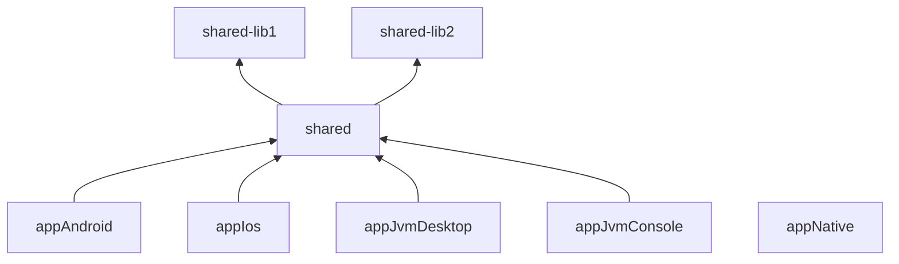
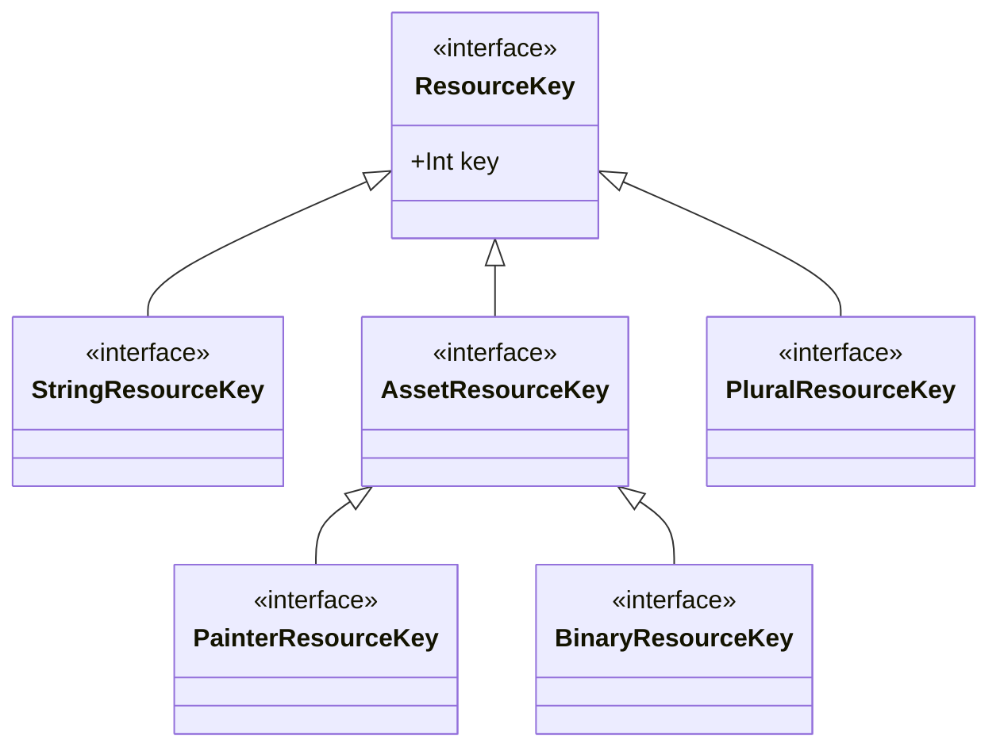

# Kostra Sample App

This sample is made to show real usage of the kostra library.

Project setup


## Internals

#### ResourceKey types
Kostra has multiple `ResourceKey` types to use typing system to its advance. Following class diagram represents interfaces coming from `kostra-common`.
KGP generates same structure in each module when used to have strong binding between `K` object references and generated defaults.



As you can see in generated code, the kostra is using internally simple indexes to each particular record stored in kostra DB.
So the `K` object can look something like this:
```kotlin
//K object for Lib2
object KLib2 {
  object string {
    val textSimple = StringResourceKey(key = 0)
  }
  object plural {
    val textPlural = PluralResourceKey(key = 0)
  }
  object images {
    val capitalCity = PainterResourceKey(key = 1)
  }
  object xmls {
     val rawData = BinaryResourceKey(key = 2)
  }
}
```
All `ResourceKey` value classes are generated into `kClassName` package to avoid mistake like
`Lib1Resource.string.get(KLib2.string.textSimple)`. This code looks valid, but it's semantically incorrect, because `Lib1Resources1` are
being used with `KLib2` object.

What is important is the `key` aka DB index, which might work if the key exists in other database. Obviously the output would be wrong. Generated defaults
are preventing this due to typing system.
```kotlin
//compile time error
com.sample.lib1.stringResource(KLib2.string.textSimple)

//using Raw API compiles fine and will return wrong value or might lead to crash if DB key undefined
Lib1Resource.string.get(KLib2.string.textSimple)
```
Signature looks like this `com.sample.lib1.stringResource(key: com.sample.lib1.StringResourceKey) : String` and
`KLib2.string.textSimple` is type of `com.sample.lib2.StringResourceKey`. Same simple name, different package though. Compiler will let you know
of misuse of `Resources` and `K` object references if you are using generated defaults.

## MultiModule setup
As you can see there are `shared-lib1` as lib with compose reference, `shared-lib2` as plain library.

First important thing to understand is that all **what Kostra does is file based**.
Resources and internal databases are stored as simple file and part of the resources bundle which is included in final release product.

*Each module generates "same" code based on given data.*<br/>
**There is no real resource merging**.

#### kClassName
Unique `KClassName` is important to put everything generated into `com.sample.lib1` package to avoid any duplicates.<br/>


#### Module Prefix
To prevent any file collision, kostra has extra `kostra.modulePrefix` KGP config to help with that.
```groovy
//shared-lib1/build.gradle
kostra {
    modulePrefix = "Lib1"
    resourcesDefaults.value([ResourcesDefaults.ComposeGetters])
    KClassName = "com.sample.lib1.KLib1"
}
```
Specific `modulePrefix` value has a side effect for the resources analysis, so they can be stored:
```shell
sample/shared-lib1/src/commonMain/resources/lib1/group/image.png
```
*Notice the extra `lib1` subdirectory.*
<br/><br/> With no `modulePrefix`, the `image.png` would fall into `lib1` group referencable via `K.lib1.image`, adding the `kostra.modulePrefix = "Lib1"` makes
the 1st resources subdirectory ignored if it's matching (case-insensitive) `modulePrefix` and becomes `K.group.image`.
Having all resources saved in `lib1` subdirectory prevents you having potential duplicates in final product.

**Obviously, `modulePrefix` and package from `KClassName` must be unique per each module.**

#### ResourceDefaults

Using `ResourcesDefaults.ComposeCommon` and `ResourcesDefaults.Common` defaults might be annoying for usage in a multimodule setup.
Having a screen using multiple resources coming from different modules, you will end up having as many imported default functions like `stringResource` as your number of used
module resources is. Autocomplete in the file becomes annoying because of a lot of identically named functions offered.

For this case, it's better to use `ResourcesDefaults.ComposeGetters` or `ResourcesDefaults.Getters`. KGP config
`kostra.resourcesDefaults.value(listOf(com.jibru.kostra.plugin.ResourcesDefaults.ComposeGetters))` makes KGP generate only specified variant of getters.

Your code will be then using extension functions on the `ResourceKey` types.
```kotlin
println(KLib1.string.textLib1.get())
println(KLib2.string.textLib2.get())
```

#### Interfaces

KGP has also extra setting to generate interfaces for `K` objects for easier class delegation if necessary for "merged look a like" `K` object.
Just enable it via `kostra.interfaces = true`, it's being enabled automatically if there is non empty `kostra.modulePrefix`.

#### Class delegation

With interfaces generated, a global `K` object can be made simply using class delegation.
```kotlin
object KM {
    object string :
        IKLib1.string by KLib1.string,
        IKLib2.string by KLib2.string,
        IK.string by K.string

    object images :
        IKLib1.root by KLib1.root,
        IKLib2.root by KLib2.root,
        IK.images by K.images
}
//which can be used simply as
println(KM.images.lib1Text.get())
println(KM.images.lib2Text.get())
```
Having simple `KM` object with all merged resources makes coding UX nicer and hides multiple resources origins. <br/>
`kostra.keyMapper` might help with to have extra logic for keys.

*All keys must be unique, otherwise the class delegation will fail due to identical name with return type difference, which can't be anyhow
solved in kotlin*

#### Internals
In case of isolated module, everything kostra generated can be marked with `internal` visibility accessor. Just use
`kostra.internalVisibility = true`. All DBs must be part of the final release product and they will be still accessible like any other bundled resource.

#### IOS
KMP for iOS is currently the painful part. [KMP doesn't support any resource merging](https://github.com/JetBrains/compose-multiplatform/issues/3391) on any level.
It must be done manually, for example [this way](https://github.com/jbruchanov/kostra/blob/KS-70_docs/sample/build.gradle).
```groovy
//shared/build.gradle

//simple reference for all depending modules
def depModules = [project(":shared-lib1"), project(":shared-lib2")]

kotlin {
    sourceSets {
        commonMain {
            dependencies {
                //add a project module as a dependency, just like in any other case
                //'api' instead of implementation is necessary for cocoapods export if you use them
                depModules.forEach {
                    api(it)
                }
            }
        }

        iosMain {
            //add explicit reference to use module resources + kostra resources as part of this build
            //similarly this can be done for any transitive dependency coming outside of project directly
            //merging validation of running on iosSimulator is in
            //kostra/sample/build/ios/Debug-iphonesimulator/appIos.app/compose-resources/
            depModules.forEach { Project p ->
                resources.srcDirs(new File(p.projectDir, "src/commonMain/resources"))
                resources.srcDirs(new File(p.buildDir, "kostra/resources"))
            }
        }
    }
}

//just ensure that lib DBs are created with 'shared' module DB, probably unnecessary
tasks.getByName("generateDatabases")
    .dependsOn(":shared-lib1:generateDatabases", ":shared-lib2:generateDatabases")
```

#### Native App
This is just a MVP proof of concept, therefore no using any of shared modules.
Afaik there is no way currently how to easily bundle the resources to your executable file.
There is also no resource merging for native. This example just copies all the resources into a build output directory.
Running the native app from IDE will fail with "Unable to find resources" exception, there seems to be no way how to specify what should be the
working directory.

To test it, just run
`./gradlew appNativeConsole:assemble` and outputs go to `build/bin/native/releaseExecutable`. Running the `./appNativeConsole` works as expected,
tested on `Windows`, `Ubuntu in Windows`, `MacOs`.

## License

[Apache License 2.0](https://github.com/jbruchanov/kostra/blob/develop/LICENSE)
